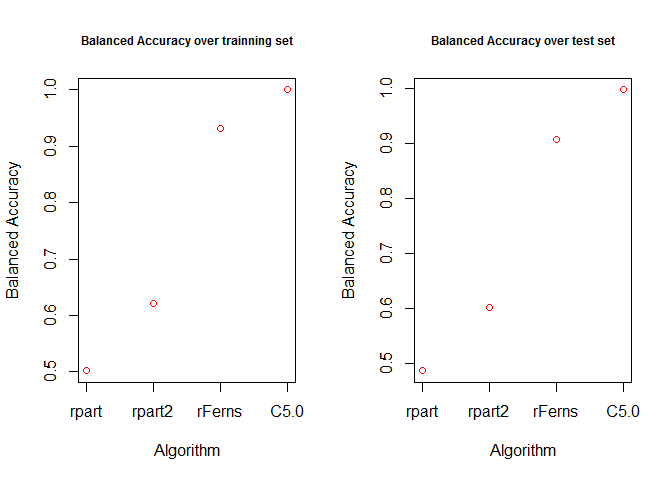

# Practical machine Learning - Prediction Assignment
Gadi  
Friday, August 22, 2014  

#### Synopsis


Using devices such as Jawbone Up, Nike FuelBand, and Fitbit it is now possible to collect a large amount of data about personal activity relatively inexpensively. These type of devices are part of the quantified self movement – a group of enthusiasts who take measurements about themselves regularly to improve their health, to find patterns in their behavior, or because they are tech geeks. One thing that people regularly do is quantify how much of a particular activity they do, but they rarely quantify how well they do it. In this project, your goal will be to use data from accelerometers on the belt, forearm, arm, and dumbell of 6 participants. They were asked to perform barbell lifts correctly and incorrectly in 5 different ways. More information is available from the website here: http://groupware.les.inf.puc-rio.br/har (see the section on the Weight Lifting Exercise Dataset).

This  project finds a classifier to  predict the manner in which they did the exercise. 

#### Data Processing


##### Obtaining the data
- The training data was obtained from  <https://d396qusza40orc.cloudfront.net/predmachlearn/pml-training.csv> 

- The test  data was obtained from  <https://d396qusza40orc.cloudfront.net/predmachlearn/pml-testing.csv> 

- And its documentation is found in  <http://groupware.les.inf.puc-rio.br/har>

After downloading the data sets we read them into to data frames df, and dft correspondingly


```r
#opts_chunk$set(warning = FALSE, message=FALSE)
setwd("C:/Users/Gadi/Documents/GitHub/PMLproject")
library(caret)
```

```
## Loading required package: lattice
## Loading required package: ggplot2
```

```r
library(rattle)
```

```
## Rattle: A free graphical interface for data mining with R.
## Version 3.1.0 Copyright (c) 2006-2014 Togaware Pty Ltd.
## Type 'rattle()' to shake, rattle, and roll your data.
```

```r
library(rpart)
library(e1071)
library(rFerns)
set.seed(34555)
df <- read.csv("pml-training.csv", stringsAsFactors = TRUE)
dft <- read.csv("pml-testing.csv", stringsAsFactors = TRUE)
```

##### cleanning the data

As a first step we cleaned the data by deleting columns with over 50% of NA or "" values. (In case that the prediction will not be good enough without these columns the plan was to further analyze them). Also the index column (in location 1) was deleted to avoid trainning incorrect models (e.g. in case that of sorted input by outcome)


```r
cols <- apply(df, 2, function(x) length(which(!is.na(x) & !x==""))/length(x)) > 0.5
df1 <- df[,cols]
df1 <- df1[,-1]
```

Then we checked the remaining columns to check the amount of NA in them, no NA was detected in these columns so there was no need to treat missing information.


```r
colsWithNA <- ncol(df[1,apply(df[,cols], 2, function(x) length(which(!is.na(x)))/length(x)) < 1])
colsWithNA
```

```
## [1] 0
```

##### splitting the data

The data was split into two sets training (3/4 of the data) and testing (1/4 of the data), the later will be used for performing cross validation. (note: this testing set is not the test set stored in dft)


```r
inTrain = createDataPartition(df1$classe, p = 3/4,list=FALSE)
training = df1[ inTrain,]
testing = df1[-inTrain,]
```

##### Training the models

We used the training  set to train four models based on  rpart, rpart2, rFerns, and C5.0, using their default parameters in the caret library. The models are described in http://caret.r-forge.r-project.org/bytag.html  


```r
modFit1 <- train(classe~.,method = 'rpart',data=training)
modFit2 <- train(classe~.,method = 'rpart2',data=training)
modFit3 <- train(classe~.,method = 'rFerns',data=training)
modFit4 <- train(classe~.,method = 'C5.0',data=training)
```

```
## Loading required package: C50
```

```
## Warning: package 'C50' was built under R version 3.1.1
```

```
## Loading required package: plyr
```

##### comparing the models and cross-validation

We compared the performance 4 resulting models  both on the training set and on the test set and then plotted their overall accuracy on both sets. 


```r
prediction1 <- predict(modFit1,newdata=testing)
prediction2 <- predict(modFit2,newdata=testing)
prediction3 <- predict(modFit3,newdata=testing)
prediction4 <- predict(modFit4,newdata=testing)
sanity1 <- predict(modFit1,newdata=training)
sanity2 <- predict(modFit2,newdata=training)
sanity3 <- predict(modFit3,newdata=training)
sanity4 <- predict(modFit4,newdata=training)
c1 <- confusionMatrix(prediction1, testing$classe)
c2 <- confusionMatrix(prediction2, testing$classe)
c3 <- confusionMatrix(prediction3, testing$classe)
c4 <- confusionMatrix(prediction4, testing$classe)
s1 <- confusionMatrix(sanity1, training$classe)
s2 <- confusionMatrix(sanity2, training$classe)
s3 <- confusionMatrix(sanity3, training$classe)
s4 <- confusionMatrix(sanity4, training$classe)
```

Rpart significantly under performed with an accuracy of only 0.4865 on the test set,  rpart2, rFerns resulted in better accuracy with similar results in both sets (rpart2 0.6208 and 0.6026in the training and testing sets correspondingly  and  rFerns 0.9313 and 0.9086in the training and testing sets correspondingly),  C5.0 results were superior to all the other algorithms with accuracy of  0.9982 in the testing set


```r
par(mfrow=c(1,2),cex.main = 0.75)
plot(c(s1$overall[1],s2$overall[1],s3$overall[1],s4$overall[1]),type="p",col="red",
     main="Balanced Accuracy over trainning set",ylab="Balanced Accuracy",xlab="Algorithm",axes=FALSE)
axis(1, at=1:4, lab=c("rpart", "rpart2", "rFerns", "C5.0"))
axis(2)
box()
plot(c(c1$overall[1],c2$overall[1],c3$overall[1],c4$overall[1]),type="p",col="red",
     main="Balanced Accuracy over test set",ylab="Balanced Accuracy",xlab="Algorithm",axes=FALSE)
axis(1, at=1:4, lab=c("rpart", "rpart2", "rFerns", "C5.0"))
axis(2)
box()
```

 


##### Results
Given the excellent results of C5.0 (see confusion matrix)

```
## Confusion Matrix and Statistics
## 
##           Reference
## Prediction    A    B    C    D    E
##          A 1395    0    0    0    0
##          B    0  948    0    0    0
##          C    0    1  851    1    1
##          D    0    0    4  802    1
##          E    0    0    0    1  899
## 
## Overall Statistics
##                                         
##                Accuracy : 0.998         
##                  95% CI : (0.997, 0.999)
##     No Information Rate : 0.284         
##     P-Value [Acc > NIR] : <2e-16        
##                                         
##                   Kappa : 0.998         
##  Mcnemar's Test P-Value : NA            
## 
## Statistics by Class:
## 
##                      Class: A Class: B Class: C Class: D Class: E
## Sensitivity             1.000    0.999    0.995    0.998    0.998
## Specificity             1.000    1.000    0.999    0.999    1.000
## Pos Pred Value          1.000    1.000    0.996    0.994    0.999
## Neg Pred Value          1.000    1.000    0.999    1.000    1.000
## Prevalence              0.284    0.194    0.174    0.164    0.184
## Detection Rate          0.284    0.193    0.174    0.164    0.183
## Detection Prevalence    0.284    0.193    0.174    0.165    0.184
## Balanced Accuracy       1.000    0.999    0.997    0.998    0.999
```

we did not investigate further models, or  different set of attributes, or different parameters. C5.0 provided an excellent predictor. 


```r
pml_write_files = function(x){
        n = length(x)
        for(i in 1:n){
                filename = paste0("problem_id_",i,".txt")
                write.table(x[i],file=filename,quote=FALSE,row.names=FALSE,col.names=FALSE)
        }
}
dft <- read.csv("pml-testing.csv", stringsAsFactors = TRUE)
dft1 <- dft[,cols]
dft1 <- dft1[,-1]
prediction5 <- predict(modFit4,newdata=dft1)
pml_write_files(prediction5)
```

Further applying the model to  20 test cases available in dft (<https://d396qusza40orc.cloudfront.net/predmachlearn/pml-testing.csv> ) and  submitting the predictions in appropriate format to the programming assignment for automated grading. resulted in 100% accuracy with the following predicted values


```
##  [1] B A B A A E D B A A B C B A E E A B B B
## Levels: A B C D E
```


